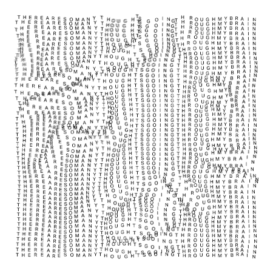

  
  

  

  

  
  
  
  
  

 

## About Me

  

- 🔭 Currently building **[CashCrunch](https://github.com/om9494/Cash-Crunch.git)**
- 🌱 Learning **Angular, modern frontend frameworks & scalable web app development**
- 👯 Open to collaborate on **[BookMyShow Clone](https://github.com/om9494/Book-My-Show-Full-Architecture.git)**
- 🤝 Looking for help with **[Crypto Trading Platform](https://github.com/om9494/Crypto-Trading)**
- 💬 Ask me about **Java, Spring Boot, Node.js, Express.js, REST APIs & backend architecture**
- 👨‍💻 Portfolio: **[om-panchal-portfolio.vercel.app](https://om-panchal-portfolio.vercel.app/)**
- 📫 Email: **panchalom027@gmail.com**

 

## Tech Stack

  

  

  

 

## GitHub Streak

  

 

## Contribution Snake

  

 

  

